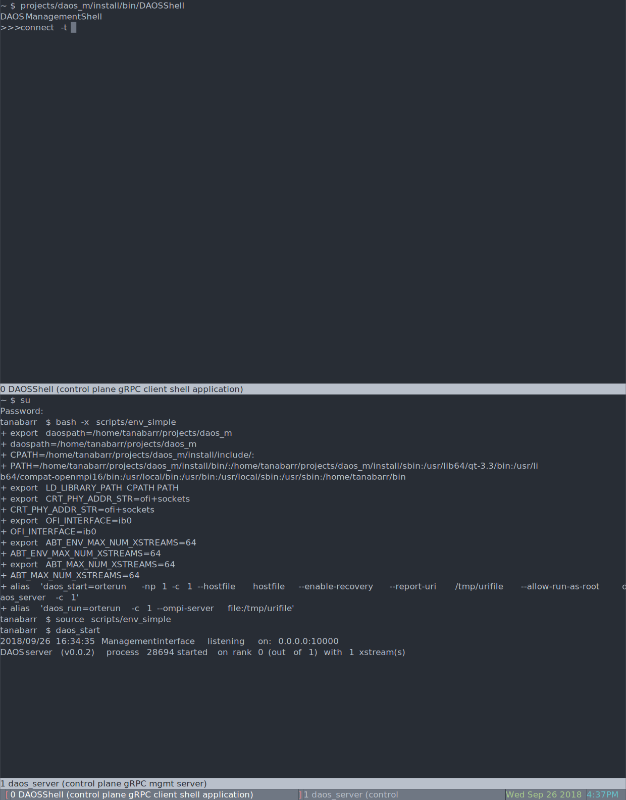
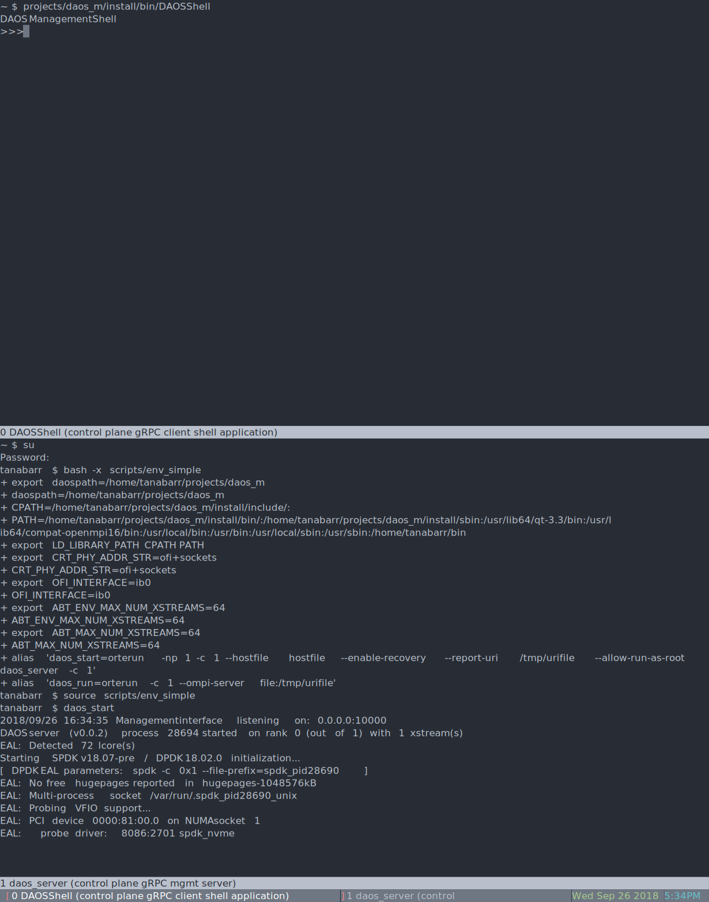

# daos_server

This Go package provides a [control server](server/daos_server.go) that implements the DAOS control-plane. The control server is a Go process responsible for the initialisation and management of the DAOS IO servers mainly through a Unix domain socket.

The control server implements the [gRPC protocol](https://grpc.io/) to communicate with client gRPC applications.

Multiple gRPC server modules are loaded by the control server. Currently included modules are security and management.

The [shell](shell/DAOSShell) is an example client application which can connect to both the [agent](agent/daos_agent.go) to perform security functions (such as providing credentials and retrieving security contexts) and to the local management server to perform management functions (such as storage device discovery).

## Usage

In order to run the shell to perform administrative tasks, build and run the `daos_server` as per the [quickstart guide](https://github.com/daos-stack/daos/blob/master/doc/quickstart.md).

`daos_server` is to be run as root in order to perform administrative tasks, to be run through `orterun` as root:

```
root$ orterun -np 1 -c 1 --hostfile hostfile --enable-recovery --allow-run-as-root --report-uri /tmp/urifile daos_server -c 1
```

DAOSShell (the client application) is to be run as a standard, unprivileged user.  The shell can be used to connect to and interact with the gRPC server (running on port 10000 by default) as follows:
```
$ projects/daos_m/install/bin/DAOSShell
DAOS Management Shell
>>> connect -t '127.0.0.1:10000'
>>> help
Commands:
  clear                 clear the screen
  connect               Connect to management infrastructure
  exit                  exit the program
  gethandle             Command to test requesting a security handle
  getmgmtfeature        Command to retrieve the description of a given feature
  getsecctx             Command to test requesting a security context from a handle
  help                  display help
  listmgmtfeatures      Command to retrieve all supported management features
  nvme                  Perform tasks on NVMe controllers
>>>
```

### NVMe Controller and Namespace Discovery

The following animation illustrates starting the control server and using the management shell to view the NVMe Namespaces discovered on a locally available NVMe Controller (assuming the quickstart_guide instructions have already been performed):



The following is a text listing of the commands used in the above animation:

```
$ projects/daos_m/install/bin/DAOSShell
DAOS Management Shell
>>> connect -t '127.0.0.1:10000'
>>> help
Commands:
  clear                 clear the screen
  connect               Connect to management infrastructure
  exit                  exit the program
  gethandle             Command to test requesting a security handle
  getmgmtfeature        Command to retrieve the description of a given feature
  getsecctx             Command to test requesting a security context from a handle
  help                  display help
  listmgmtfeatures      Command to retrieve all supported management features
  nvme                  Perform tasks on NVMe controllers
>>> listmgmtfeatures
Listing supported mgmt features:
nvme-namespaces : Discover NVMe namespaces on controllers
nvme-burn-in : Perform burn-in quality test on NVMe controllers
nvme-fw-update : Perform firmware image update on NVMe controllers
io-start : Start DAOS IO Service
>>> getmgmtfeature nvme-namespaces
Feature: nvme-namespaces
Description: Discover NVMe namespaces on controllers
Category: nvme
>>>
```

To use a supported management feature, run the relevant top-level command e.g. `nvme` and follow the interactive prompts:
NOTE: SPDK is used to manage NVMe devices and will unbind them from currently bound drivers while performing management tasks (but won't unbind PCI devices that have active mountpoint), they will be rebound to original drivers when management tasks are complete.

```
>>> nvme
```

_enter_

```
Select the controllers you want to run tasks on.
 >- [0] model:"INTEL SSDPED1K375GA " serial:"PHKS7335006W375AGN  " pciaddr:"0000:81:00.0" fwrev:"E2010324"
```

_space_

```
 >X [0] model:"INTEL SSDPED1K375GA " serial:"PHKS7335006W375AGN  " pciaddr:"0000:81:00.0" fwrev:"E2010324"
```

_enter_

```
Select the task you would like to run on the selected controllers.
 > [0] nvme-namespaces - Discover NVMe namespaces on controllers
   [1] nvme-burn-in - Perform burn-in quality test on NVMe controllers
   [2] nvme-fw-update - Perform firmware image update on NVMe controllers
```

_enter_

```
Running task nvme-namespaces on the following controllers:
        - model:"INTEL SSDPED1K375GA " serial:"PHKS7335006W375AGN  " pciaddr:"0000:81:00.0" fwrev:"E2010324"

Controller: model:"INTEL SSDPED1K375GA " serial:"PHKS7335006W375AGN  " pciaddr:"0000:81:00.0" fwrev:"E2010324"
        - Namespace ID: 1, Capacity: 375GB
>>>
```


### NVMe Controller Firmware Update

The following animation illustrates starting the control server and using the management shell to update the firmware on a locally available NVMe Controller (assuming the quickstart_guide instructions have already been performed):



The following is a text listing of command line output when updating NVMe controller firmware as in the above animation:

```
Select the task you would like to run on the selected controllers.
   [0] nvme-namespaces - Discover NVMe namespaces on controllers
   [1] nvme-burn-in - Perform burn-in quality test on NVMe controllers
 > [2] nvme-fw-update - Perform firmware image update on NVMe controllers

Running task nvme-fw-update on the following controllers:
        - model:"INTEL SSDPED1K375GA " serial:"PHKS7335006W375AGN  " pciaddr:"0000:81:00.0" fwrev:"E2010420"

Please enter firmware image file-path: /tmp/E2010413_EB3B0408_WFWM0140_EAP7Z412_no_vpd_signed.bin
Please enter slot you would like to update [default 0]:

Controller: model:"INTEL SSDPED1K375GA " serial:"PHKS7335006W375AGN  " pciaddr:"0000:81:00.0" fwrev:"E2010420"
        - Updating firmware on slot 0 with image /tmp/E2010413_EB3B0408_WFWM0140_EAP7Z412_no_vpd_signed.bin.

Successfully updated firmware from revision E2010420 to E2010413!
>>>
```

## Architecture

First a view of software component architecture:


Then communication interfaces:

```
    ┌───────────────┐ ┌───────────────┐
    │  Go Shell     │ │ Other Client  │
    └───────────────┘ └───────────────┘
            │                 │
            └────────┬────────┘
                     ▼
          ┌─────────────────────┐
          │    Go daos_server   │----|
          └─────────────────────┘    |
                     │               |
                     ▼               |
       ┌───────────────────────────┐ |
       │     Unix Domain Socket    │ |
       └───────────────────────────┘ |
                     │               |
                     ▼               |
          ┌─────────────────────┐    |
          │   C daos_io_server  │    |
          └─────────────────────┘    |
                     │               |
                     ▼               |
           ┌────────────────────┐    |
           │ Persistent Storage │<---|
           └────────────────────┘
```
TODO: include details of `daos_agent` interaction

## Development Requirements

* [Golang](https://golang.org/) 1.9 or higher
* [gRPC](https://grpc.io/)
* [Protocol Buffers](https://developers.google.com/protocol-buffers/)
* [Dep](https://github.com/golang/dep/) for managing dependencies in vendor directory.

## Development setup

* Update vendor directory if needed: `utils/fetch_go_packages.sh -i .` from daos checkout root directory.
* (Optional) protoc protocol buffer compiler

### Building the app

#### Local

* `scons` (binaries should be produced in `install/bin` directory)

### Testing the app

* Run the tests `go test` within each directory containing tests
